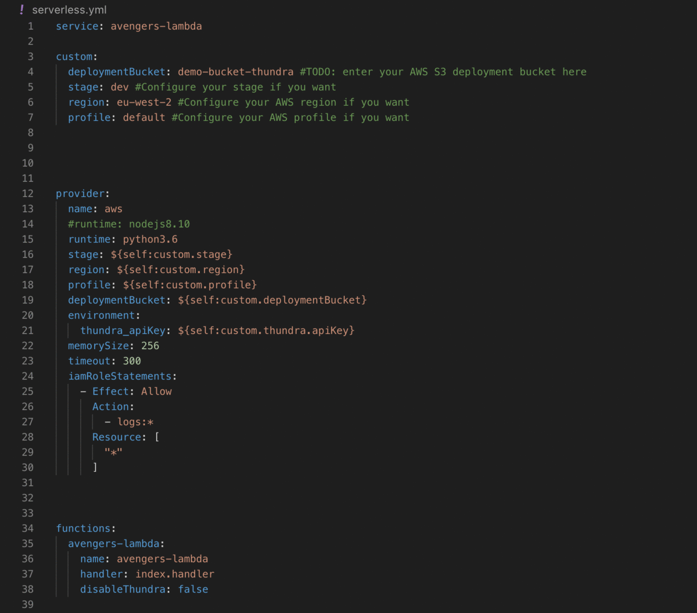

# serverless-plugin-thundra
[](http://www.serverless.com)
[](https://badge.fury.io/js/serverless-plugin-thundra)

Automatically wrap your AWS Lambda functions with Thundra for the serverless framework ⚡️ https://thundra.io

Check out [Thundra docs](https://docs.thundra.io/v1.0.0/) for more information.

## Installation

```bash
npm install serverless-plugin-thundra
```

## Usage

Thundra's serverless plugin allows you to automatically wrap your Python and Node.js Lambda functions to enable monitoring with Thundra.

Please ensure that along with this library, you also dowload the respective library of the Thundra agent related to the language in which you are
developing.

For Thundra's Python agent:

```bash
pip3 install thundra -t .
```

For Thundra's Node agent:

```bash
npm install @thundra/core --save
```

After installing the respective Thundra agent and Thundra's serverless plugin with the `npm install serverless-plugin-thundra`. Add it to your serverless
plugins by including itunder the `plugins` section of your '.yml' file.

```bash
plugins:
  - serverless-plugin-thundra
```



Ensure that the plugin is the first plugin you add under `plugins`

Furthermore, add the `thundra` component under `custom` with `apiKey` under that, as seen below:

```bash
custom:
  thundra:
    apiKey: <YOUR THUNDRA API KEY>
```

## Configuration

You can configure Thundra's serverless plugin to disable specific functions, or the whole plugin in general.

### Disable Plugin:

You may disable Thundra's serverless plugin by using the `disable` variable under the `thundra` component which you added under `custom` when adding the plugin to
your '.yml' file.

```bash
custom:
  thundra:
    apiKey: <YOUR THUNDRA API KEY>
    disable: true
```

### Disable Specific Functions:

You may disable automatic wrapping of specific functions by using the `disableAutoWrap` variable when defining your functions under the `functions` component.

```bash
functions:
  hello-world-test:
    name: hello-world-test
    handler: index.handler
    disableAutoWrap: false
```
