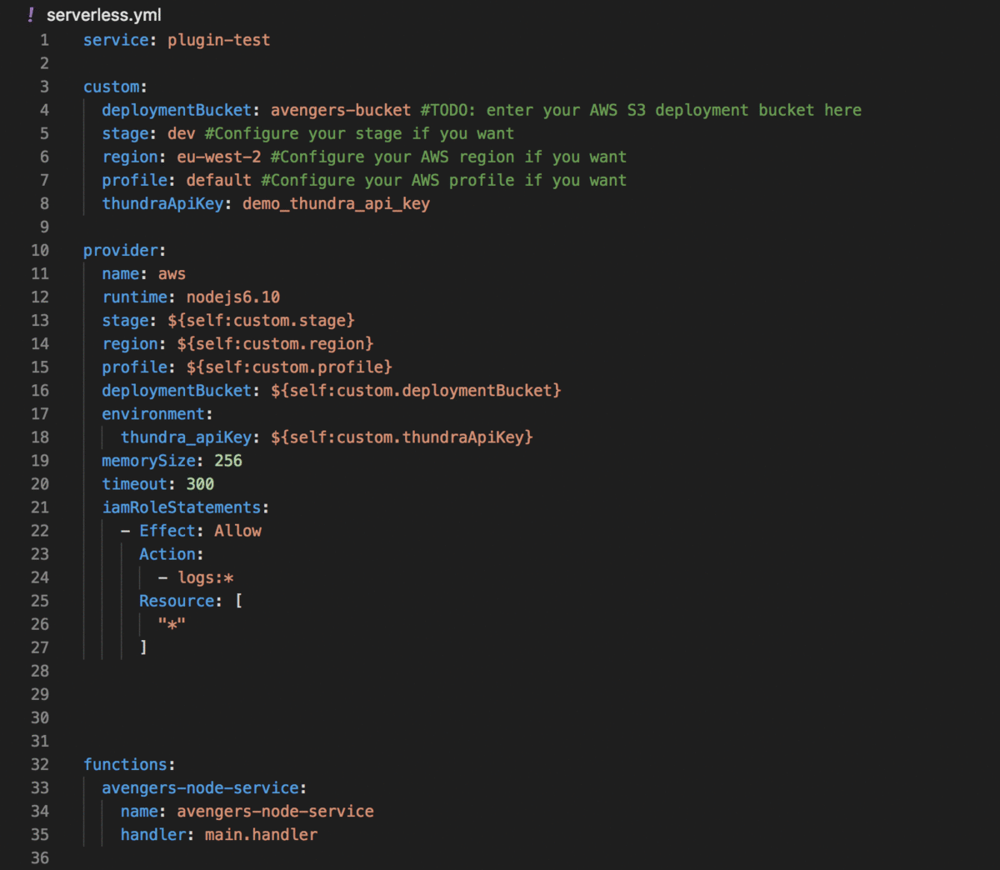

# serverless-plugin-thundra

Automatically wrap your AWS Lambda functions with Thundra for the serverless framework ⚡️ https://thundra.io

Check out [Thundra docs](https://thundra.readme.io/docs) for more information.

## Installation

```bash
npm install serverless-plugin-thundra
```

## Usage

Thundra's serverless plugin allows you to automatically wrap your Python and Node.js Lambda functions to enable monitoring with Thundra.

Please ensure that along with this library, you also dowload the respective library of the Thundra agent related to the language in which you are
developing.

After installing Thundra's serverless plugin with the `npm install serverless-plugin-thundra`. Add it to your serverless plugins by including it
under the `plugins` section of your '.yml' file.

```bash
plugins:
  - serverless-plugin-thundra
```


